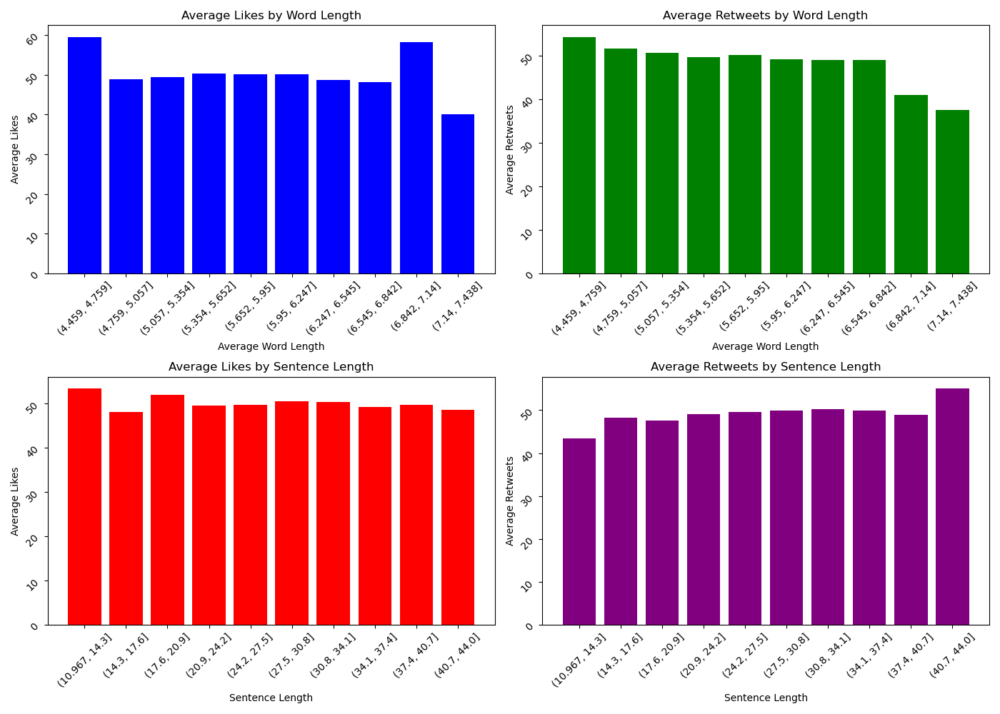

# Group 3: Prediction of Online Engagement for Tweets

## Introduction

-   **Introduction**: Twitter is a potent platform for information
    dissemination and social interaction, making it a critical tool for
    individuals, brands, and organizations seeking to influence, inform,
    or engage with a broad audience. By predicting the engagement of
    Twitter, we can see how best each tweet performs, the sentiment
    around tweet, the various topics discussed as well as the most
    important/influencial topics etc.

    The primary goal of this project is to predict Twitter engagement
    based on the text of tweets. By analyzing the text, we can be able
    to extract additional features which can be used to predict the
    level of engagement; which we take as the sum of the likes and
    retweets for each user.

## Data Overview

-   **Initial Observations**: The dataset encompasses five critical
    variables: Tweet_ID, Username, Text, Retweets, Likes, and Timestamp,
    representing 1,000 unique tweets. Each record is complete, with no
    missing entries, providing a strong foundation for our analysis.

    Initial inspection revealed that some tweet texts were contextually
    ambiguous or seemed incomplete. To address this, a detailed content
    analysis was performed. This exploration focused on identifying key
    themes, topics, and sentiments within the tweets, which are crucial
    for understanding the factors that drive engagement.

    Moreover, the consistency of data across the Retweets and Likes
    metrics suggests potential patterns of user engagement that could be
    explored for predictive insights. The Timestamp data also offers an
    opportunity to examine how engagement varies over time, possibly
    relating to daily or weekly activity cycles on Twitter.

    This enriched data overview not only confirms the dataset's
    readiness for further analysis but also guides our subsequent
    exploratory and predictive efforts. By delving into the nuances of
    tweet content and engagement trends, we aim to uncover actionable
    insights that could inform effective Twitter strategies.

## Data Preprocessing

-   **Text Preprocessing Steps**: The following steps were applied for
    the preprocessing of the data. Normalization and Cleaning:
-   ***Lowercasing***: All the text was converted to lower case to unify
    the format.
-   ***URL and Special Character Removal***: We employed regular
    expressions to eliminate URLs and non-alphabetic characters,
    focusing analysis purely on textual content.
-   ***Tokenization and Stopword Removal***: The text feature was split
    into individual words using NLTK's word_tokenize. After which the
    common enlish stop words were filtered using NLTK to focus on more
    meaningful words in the text.

## Exploratory Data Analysis (EDA)

-   **Visualizations**: Include images of key plots and discuss what
    they reveal.
-   **Insights Gained**: Summarize the critical findings from EDA.

Here's the plot showing the top 20 most frequent words in tweets:

### Engagement Metrics Analysis

The visualizations below represent the average likes and retweets by
hour of day and day of week. These insights can help understand peak
times for engagement on Twitter.

### Analysis of Engagement by Readability Score

The following plots illustrate how engagement metrics such as likes and
retweets vary with different readability scores. This can help
understand which content is more engaging based on its readability.

### Engagement Analysis by Text Length

The following visualization shows how engagement metrics such as likes
and retweets vary with text characteristics including word length and
sentence length. This analysis can help understand what text features
correlate with higher engagement.

### Engagement Analysis by Topic

The following visualization shows how engagement metrics such as likes
and retweets are distributed across different dominant topics. This
analysis can help identify topics that generate higher engagement on
social media platforms.

### Monthly Engagement Analysis

The visualizations below represent the trends in average likes and
retweets per month. Analyzing these trends helps understand engagement
patterns over time, highlighting peak periods of user interaction.

### Sentiment and Engagement Analysis Over Time

The visualizations below illustrate the monthly trends in average
sentiment and engagement metrics such as likes and retweets. This
comprehensive analysis helps in understanding how sentiment correlates
with user engagement over time.

## Feature Extraction

-   **Feature Creation**: We engineered several features from the
    existing data to enhance our predictive modeling capabilities:

-   ***TF-IDF Vectorization***: Finally, we transformed cleaned text
    into a numerical format using TfidfVectorizer, limiting to the top
    100 most relevant terms. This method highlights the importance of
    words relative to the document corpus, ideal for predictive
    modeling.

-   ***Sentiment Analysis***: We utilized TextBlob to compute the
    sentiment polarity of tweets, providing insights into the emotional
    tone of the content.

-   ***Temporal Features***: Next, the time based attributes were
    extracted such as hour_of_day, day_of_week, and month from the
    Timestamp. These features help analyze engagement patterns over
    different times and days.

-   ***Readability Scores***: We the applied textstat to calculate the
    Flesch reading ease score for each tweet, offering a measure of text
    complexity which might correlate with engagement.

-   ***Text Length Metrics***: After this, we calculated the average
    word length and sentence_length to assess the complexity and size of
    tweets.

-   ***Named Entity Recognition***: We Leveraged spaCy to extract named
    entities, adding depth to our textual analysis by identifying
    significant people, organizations, or locations mentioned in tweets.

-   ***LDA Topics*** : Then, we implemented Latent Dirichlet Allocation
    via scikit-learn to identify dominant topics within the tweet
    corpus, allowing us to explore thematic patterns in engagement.

-   ***Presence of Mentions, Hashtags, and URLs***: Binary indicators
    were created to signify the presence of mentions, hashtags, and URLs
    within tweets, which are often critical factors in engagement
    dynamics.

## Modeling

-   **Feature Selection**: For our predictive model, we focused on a set
    of features believed to significantly impact Twitter engagement.
    These included:

-   ***Textual features***: sentiment, readability_score,
    avg_word_length, sentence_length.

-   ***Temporal features***: hour_of_day, day_of_week, month.

-   ***Social indicators***: has_mentions, has_hashtags, contains_link.
    These features were chosen based on their potential to influence
    user interaction and engagement with tweets, as demonstrated during
    our exploratory data analysis phase

-   **Model Choices**: We tested a variety of models to address the
    regression nature of our target variable, Total_engagement. Our
    model selection included:

-   ***Linear Models***: Linear Regression, Ridge Regression, and Lasso
    Regression. These were chosen for their ability to provide baseline
    performance and interpretability.

-   ***Ensemble Methods***: RandomForestRegressor and
    GradientBoostingRegressor. These models were selected for their
    robustness and ability to handle non-linear relationships within the
    data effectively.

-   \***Performance Evaluation**: Model performance was assessed using
    Root Mean Squared Error (RMSE) and Mean Absolute Error (MAE) across
    a 5-fold cross-validation:

## Results and Interpretation

The cross-validation results for RMSE and MAE are as follows:

-   ***RMSE Results***: Linear Regression: 41.37 Ridge Regression: 41.37
    Lasso Regression: 41.32 Random Forest: 42.62 Gradient Boosting:
    41.50

-   ***MAE Results***: Linear Regression: 33.90 Ridge Regression: 33.90
    Lasso Regression: 33.85 Random Forest: 34.90 Gradient Boosting:
    33.98

    From these results, it appears that Lasso Regression slightly
    outperforms other linear models in both RMSE and MAE, suggesting it
    effectively regularizes and simplifies the model without significant
    loss in accuracy. Surprisingly, RandomForest, typically robust,
    performed slightly worse, indicating potential overfitting or
    inadequate parameter tuning. Gradient Boosting also shows
    competitive results, closely following the performance of Lasso
    Regression.

    These insights highlight the complexity of modeling tweet engagement
    and underscore the importance of further model tuning and
    validation, especially for the ensemble methods that might capture
    more subtle data patterns not easily modeled by linear approaches.

## Challenges and Solutions

-   **Encountered Issues**: We attempted to integrate the SetFitABSA
    model, developed by Hugging Face and Intel Labs, to perform
    Aspect-Based Sentiment Analysis (ABSA) on tweets, however, there
    were several unresolved issues around importing SetFit. Transformers
    were also explored, using pipelines and torch, but we were met with
    limited resources to run these.

-   We also attempted to explore advance word embedding techniques such
    as the BERT model, however, we are not capable of achieving this
    using the available resources

-   **How They Were Overcome**: Solutions or workarounds implemented.
    Therefore, Textblob (which is the least preferred option was
    utilised) was used to calculate the sentiment of the each tweet
    instead.

-   TF-IDF was utilised and only the most 100 features were used for our
    model. This also helped to address expected high dimensionality
    issues of the model as we were able to reduce the number of features
    manually by this method.

## Areas of Improvement

    For future improvement, we have highlighted the following areas where we could do better;

-   Expanding the dataset through additional data collection to help
    improve the robustness of the models. A more diverse data would
    provide better insights and we can also create more meaningful
    features which will better help our models.
-   Exploring other alternative machine learning techniques such as deep
    learning models and neural networks which would be useful for
    exploring non-linear behaviours.
-   Explore other techniques such as Setfit ABSA for aspect based
    sentiment analysis such as the, word embeddings etc.
